| 文档版本 | 作者  |    编写时间| 更新日志 | 技术文档编写工时| 审核人| 
| ------   | ---- | ------- | --------- | -------------- | ------ | 
| V1.0      | 张江      | 2023-07-31 | 初稿 | 3时 |?|
| V1.1      | 张江      | 2023-09-11 | 增加新denpency check功能 | 1时 |?|
| V1.2      | 张江      | 2024-02-26 | 修改展示文案 | 1时 |?|
| V1.2.1      | 张江      | 2024-03-01 | 支持git和文件操作 | 2时 |?|

## Xcode - Source Editor Extension
做iOS开发在Xcode8时对插件可能不陌生，但是之后苹果对插件做了更严格的限制,不再支持第三方的插件，对插件更名为 `Source Editor Extension`,并在WWDC上推出了`XcodeKit`,该库提供的功能有限，我们能做的功能也不多，不能与之前的第三方插件功能相比。

- 获取Xcode当前编辑或选中文本
- 修改Xcode当前编辑或选中的文本
- 在Editor下自定义自己的菜单
- Xcode中设置快捷键，执行自己的方法

#### 1.创建`Source Editor Extension`

File -> New -> project -> macOS -App

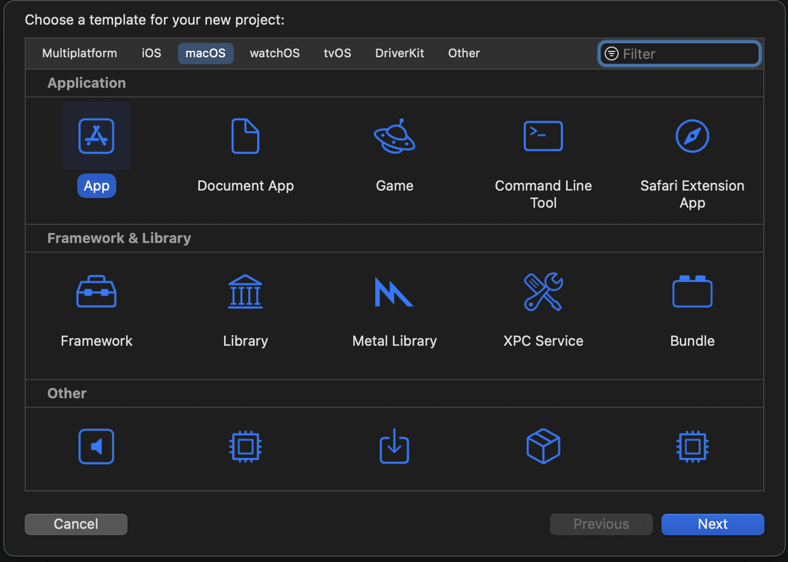

#### 2.添加一个extension
File --- New --- Target --- macOs --- Xcode Source Editor Extension
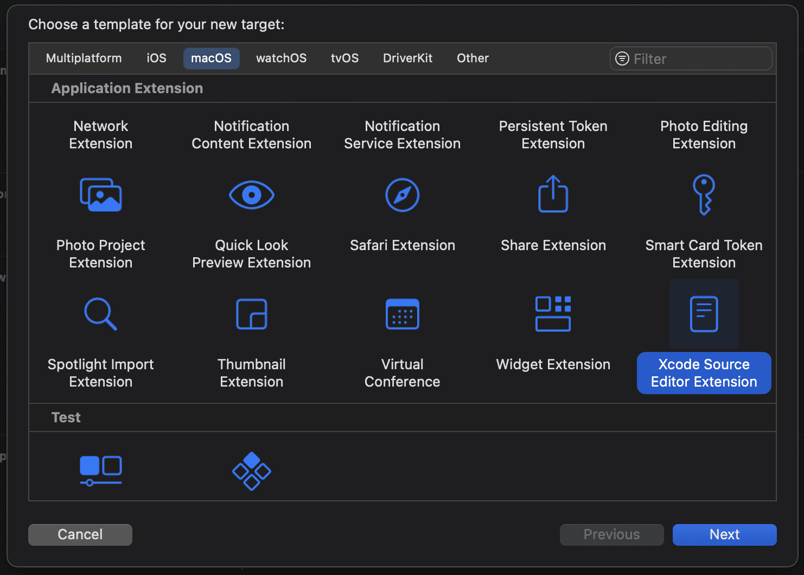

当然也可以通过下面这种方式添加，同样是选择 Xcode Source Editor Extension

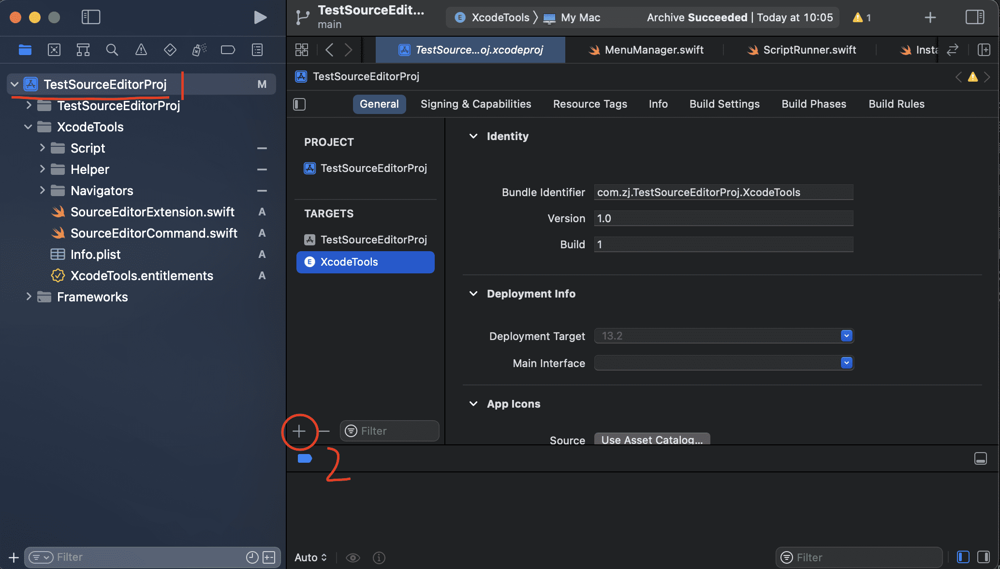

 执行之后生成的目录如下，之后在编译时选中要执行的XcodeTools

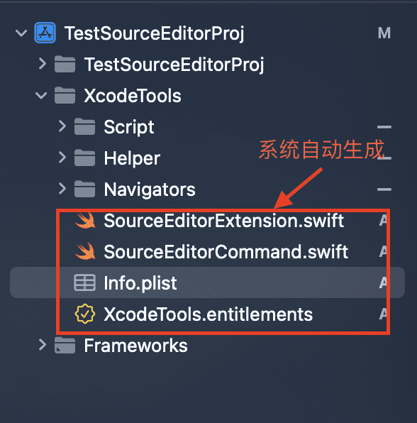


 上图中 系统会自动生成`SourceEditorExtension`和`SourceEditorCommand`两个文件，其中
 - SourceEditorCommand：可以获取当前编辑或选中的菜单命令，执行对应的方法
 - SourceEditorExtension：主要是在extension加载完成后执行任务，添加执行的方法

另外在生成的文件中还有一个plist配置文件，通过该文件也可以配置相应的菜单(详情见下文)

#### 3.自定义菜单
自定义菜单有以下两种方式，且方法二会覆盖方法一中定义的方法
##### 1.通过plist添加

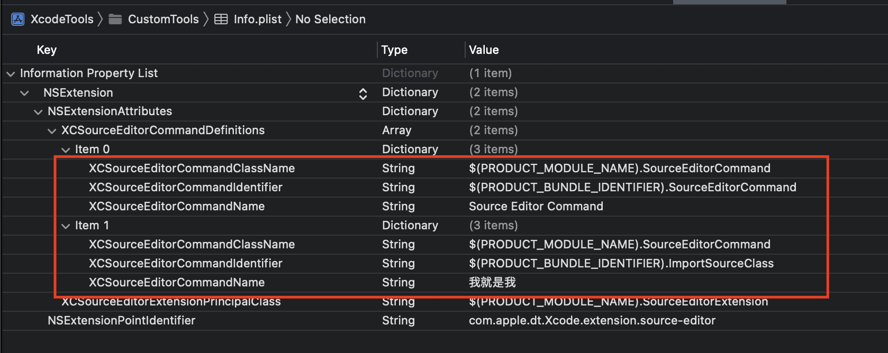

如上图定义方法 设置 className  identifier  name,其在`SourceEditorCommand`方法中会根据回调的identifier来调用方法。


##### 2.方法直接返回
通过`SourceEditorExtension`文件中系统提供的方法动态添加方法
```
/// 加载extension 成功之后做操作
func extensionDidFinishLaunching() {
        // If your extension needs to do any work at launch, implement this optional method.
        // 写入脚本文件
        DispatchQueue.main.async {
            InstallScript.installScriptFile()
        }
    }
        
    /// 执行的方法集合 也可以在 info.plist中定义 该方法和info.plist中的是互斥的
    var commandDefinitions: [[XCSourceEditorCommandDefinitionKey: Any]] {
        return MenuManager.navigators.map { navigator in
            return[
                XCSourceEditorCommandDefinitionKey.nameKey: navigator.title,
                XCSourceEditorCommandDefinitionKey.classNameKey: SourceEditorCommand.className(),
                XCSourceEditorCommandDefinitionKey.identifierKey: Helper.namespaceIdentifier(navigator.title)
            ]
        }
    }
```

#### 4.extension的运行
##### 1.选中对应的extension进行运行

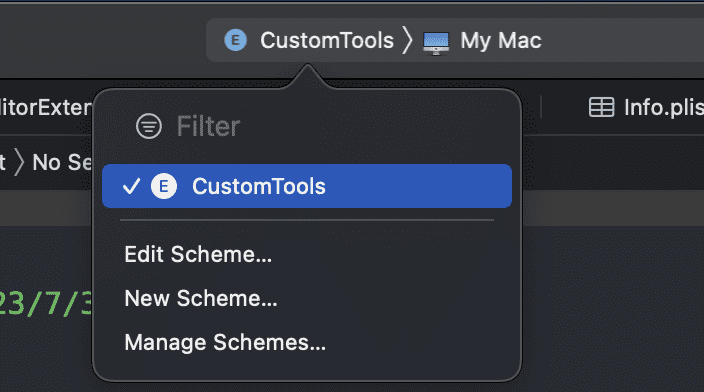

##### 2.选中xcode运行该项目

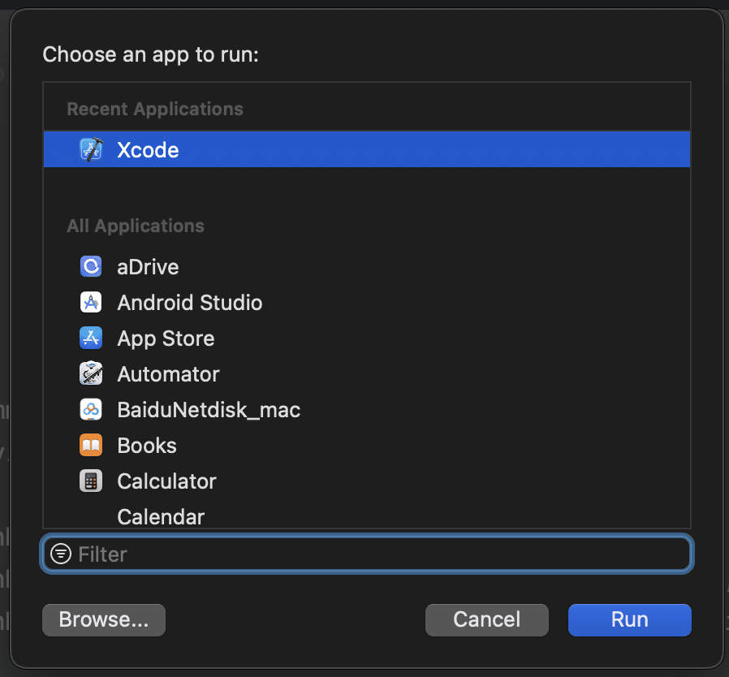

运行时随便打开一个项目 可以发现在 editor 菜单下面 多了自定义菜单 

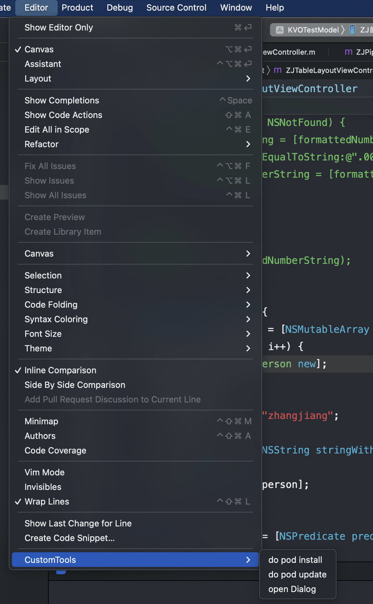

点击对应的菜单 执行相应的命令


#### 5.打包使用
提示 打包时必须使用证书，直接运行工程开始打包，选择 App development的方式将打的包导出到桌面上，单击程序开始运行，出现该提示(弹窗会出现多次 多点击几次😂😂😂，一定要保存文件，不然最后运行不了脚本)

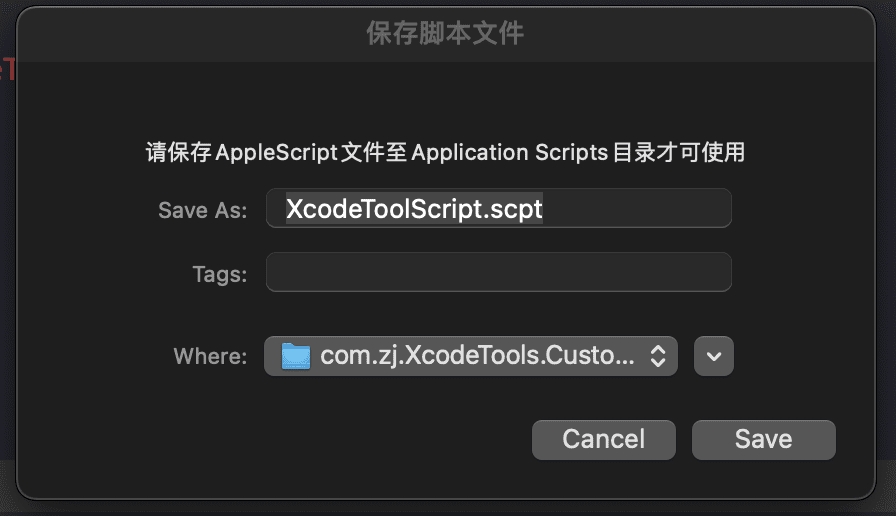

在设置中进行配置 搜索扩展 对扩展进行勾选

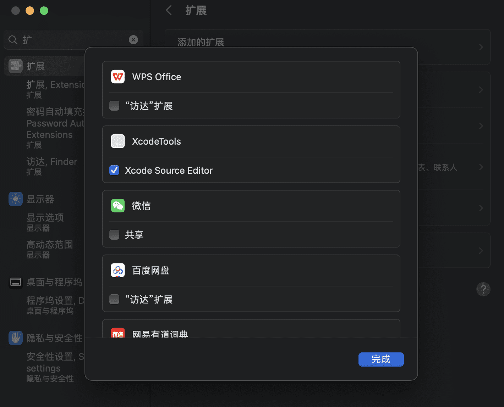


这样在每个工程中都能使用我们定义的菜单了，而且为了方便操作  我们可以定义自己的快捷键，每次修改完podfile文件 直接快捷键操作 提升 开发效率，目前支持三个操作
- pod install 
- pod update
- dy yapi 参数传递 功能如下，执行时会打开终端并打开文件夹

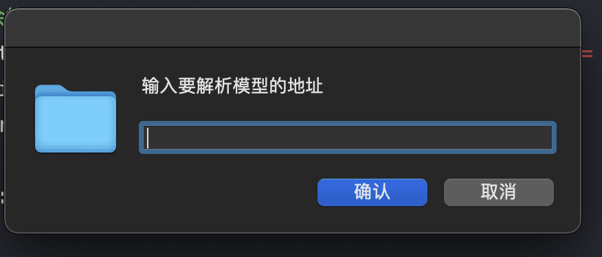

- check denpency 更新类库组件依赖，动态修改podspec中的依赖库
配置要检测的组件的路径地址

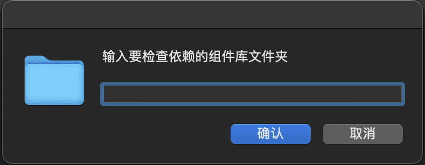

执行脚本成功 修改podspec文件

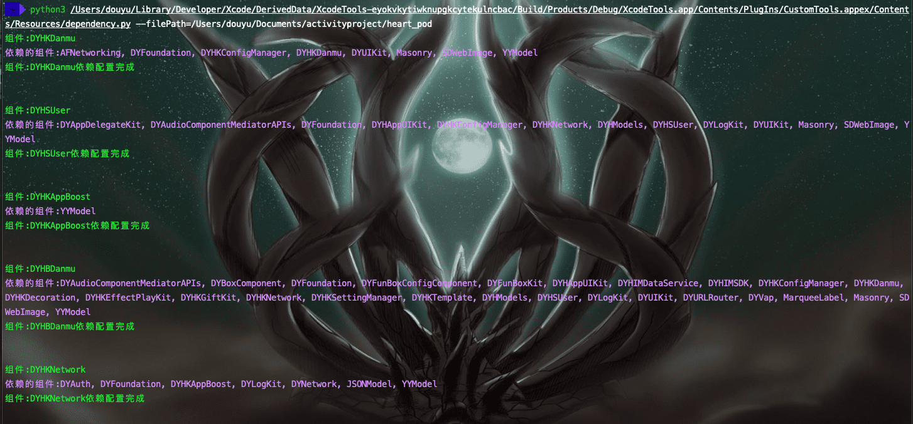

设置快捷键

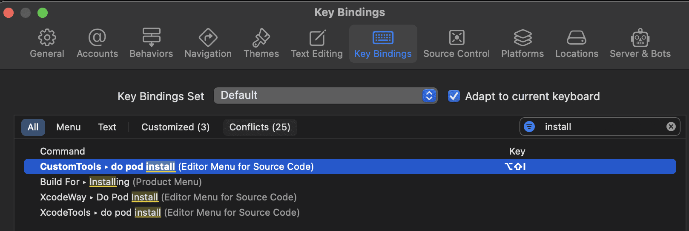

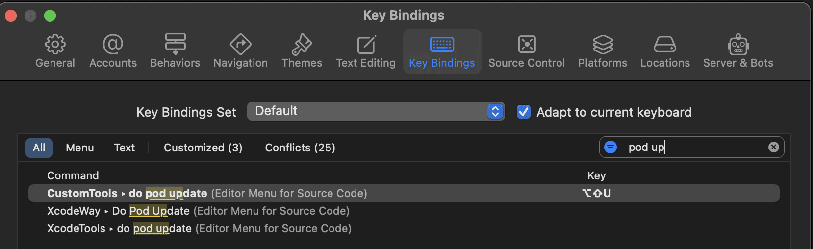

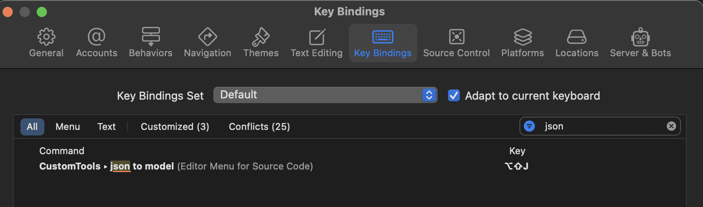&nbsp;&nbsp;&nbsp;


设置完成之后 ，右边展示的是对应的快捷键

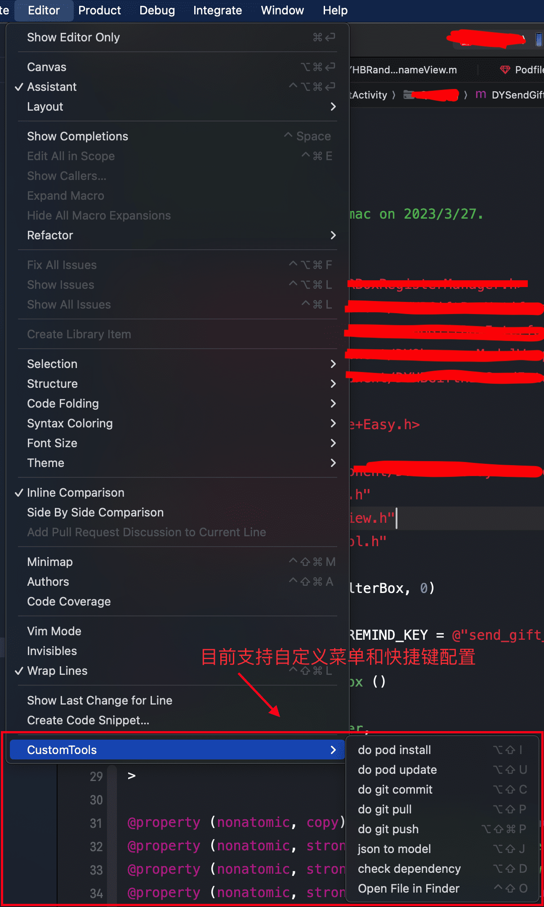


##### 1. do pod install 
* 自定菜单 直接打开终端执行 pod install操作
* 支持 iTerm2和Terminal,默认使用iTerm2，如果没有安装iTerm2 则使用系统Terminal
* 自定义快捷键 shift + option + i (可自行定义)
##### 2.do pod update
* 自定菜单 直接打开终端执行 pod install操作
* 支持 iTerm2和Terminal,默认使用iTerm2，如果没有安装iTerm2 则使用系统Terminal
* 自定义快捷键 shift + option + u (可自行定义)
##### 3.do git commit
* 自定菜单 直接打开终端执行 git commit操作
* 支持弹窗填写commit message
* 支持 iTerm2和Terminal,默认使用iTerm2，如果没有安装iTerm2 则使用系统Terminal
* 自定义快捷键 shift + option + C (可自行定义)
##### 4.do git pull 
* 自定菜单 直接打开终端执行 git pull操作
* 若有本地修改没有提交 直接走 git commit 逻辑，否则直接 git pull
* 支持 iTerm2和Terminal,默认使用iTerm2，如果没有安装iTerm2 则使用系统Terminal
* 自定义快捷键 shift + option + P (可自行定义)
##### 5.do git push
* 自定菜单 直接打开终端执行 git push操作
* 若有本地修改没有提交 直接走 git commit 逻辑，否则直接 git push
* 支持 iTerm2和Terminal,默认使用iTerm2，如果没有安装iTerm2 则使用系统Terminal
* 自定义快捷键 shift + option + command + P (可自行定义)
##### 6.json to model
* yapi上根据网址 直接生成模型 
* 具体配置见 [dy-font-cli](https://g.dz11.com/shuhai/dy-font-cli)
##### 7.check dependency
* 检测各个组件的依赖，尤其是在引用类时dependency忘记添加对应的组件 导致打包失败
##### 8.Open File in Finder
* 在xcode中直接打开当前文件所在目录并选中
* 自定义快捷键 shift + control + O (可自行定义)
如果有好的想法  可以做到xcode extension中进行

#### 6.最后
编译好的文件在附件中 下载放到应用程序中 双击打开保存对应的脚本即可(**不要修改路径 无脑保存即可**)

#### 参考资料:

[Xcode Source Editor Extension](https://www.jianshu.com/p/6492cf48a8b8)

[Mac开发App执行AppleScript](https://www.jianshu.com/p/4b9d5d7a9c6c)

[AppleScript dialogs](https://alvinalexander.com/blog/post/mac-os-x/applescript-customizing-dialog-boxes/)
